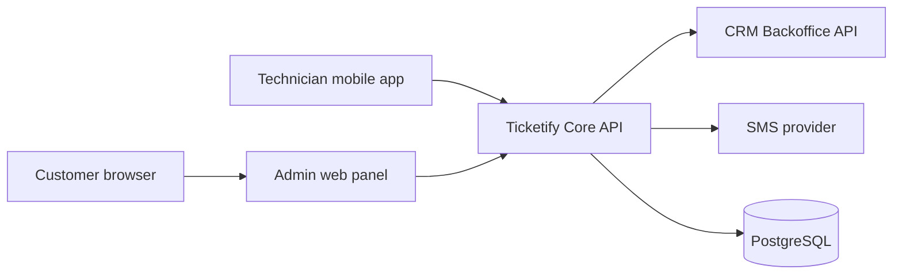

# Ticketify system architecture

This document describes how Ticketify is structured today and the patterns we follow as the system grows.

## Recommended style (fit for this product)

| Layer | Pattern | Why |
|-------|---------|-----|
| Overall | **Client–server** | Mobile app and admin panel are clients; core API is the server. |
| Backend | **Modular monolith** (NestJS modules) | One deployable API with bounded modules (auth, tickets, users, feedback). Matches team size and CRM-centric workflows without microservices overhead. |
| CRM integration | **Hexagonal (ports & adapters)** | CRM is an external system; `CrmApiClient` is the adapter. Business rules stay in services; swap CRM by changing the adapter. |
| Internals | **Layered** | Controllers → services → Prisma / CRM client. |
| Async / scale | **Not microservices yet** | Add event-driven pieces only when a concrete bottleneck appears (e.g. heavy reporting). |

Microservices would add cost (distributed tracing, eventual consistency, ops) before Ticketify needs independent scaling per domain.

## C4 – Context (Level 1)



## C4 – Containers (Level 2)

| Container | Technology | Responsibility |
|-----------|------------|----------------|
| TiketifyApp | React Native | Field workflows, tickets, location, offline-aware UX |
| ticketify-admin-panel | Next.js | Dispatch, users, reports, customer review UI |
| ticketify-core-api | NestJS + Prisma | Auth, RBAC, ticket orchestration, feedback, audit logs |
| CRM Backoffice | External REST | Source of truth for service requests |
| PostgreSQL | Prisma | Users, roles, feedback, location, app metadata |

## Module boundaries (modular monolith)

```
ticketify-core-api-main/src/
├── auth/           # Identity, JWT, login
├── user/           # Profiles, teams, location, admin users
├── tickets/        # Ticket lifecycle (orchestrates CRM)
├── activities/     # CRM activities
├── feedback/       # Post-close customer ratings
├── reports/        # Reporting
└── infrastructure/
    ├── crm/        # CRM adapter (hexagonal)
    ├── config/     # Prisma, env
    └── logger/
```

**Rules**

1. CRM HTTP calls go through `CrmApiClient`, not scattered `fetch()` (migrate legacy calls over time).
2. Modules expose behavior via services; controllers stay thin.
3. Do not share database tables across unrelated domains without going through a service.

## Data flows (main paths)

1. **Login** — Client → `POST /auth/login` → JWT → subsequent `Authorization: Bearer`.
2. **List tickets** — Client → API → CRM `GET /service_requests?assigned_to_user_id=…` → merge with app data.
3. **Start installation** — Client → `PUT /tickets/:id/start` → CRM `POST …/actions` (`START_PROGRESS`) → optional SMS → return updated ticket.
4. **Close ticket** — Client → `PUT /tickets/:id/complete` → CRM close action → SMS with review link → `CUSTOMER_REVIEW_BASE_URL`.
5. **Feedback** — Customer → admin `POST /feedbacks/:ticketId` → validate closed ticket + technician → PostgreSQL.

## Evolution (next 12 months)

- Keep **one API** deployment; tighten module boundaries and CRM adapter coverage.
- Add **read models** or caching for dashboard aggregates if CRM latency hurts UX.
- Consider **outbox/events** only if you need reliable side effects (SMS, notifications) decoupled from CRM calls.
- Split a service only when a module needs **independent scale or release cadence** with a clear owner.

## Diagrams in repo

- Security controls and SDLC: [SECURITY.md](./SECURITY.md)
