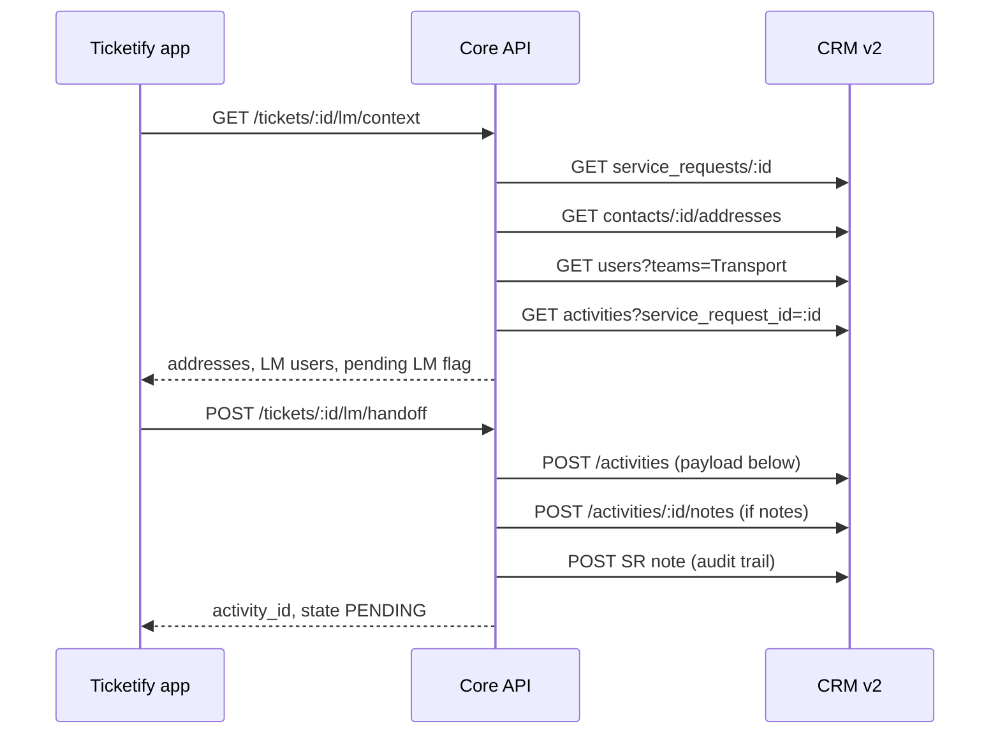

# Last Mile (Transport Network) handoff — CRM flow

This matches the CRM web **New Activity** flow you captured for **Last Mile Cabling** on service request **S40959**.

## Actors

| Role | CRM team | App action |
|------|----------|------------|
| Access Network technician | Access (owns SR) | **Hand over to Last Mile** on ticket |
| Transport / LM technician | Transport Network | Complete activity in CRM (or `PUT` complete via API) |
| Access technician | Access | Continues SR workflow after LM activity is **COMPLETED** |

## CRM IDs (staging — from your capture)

| Item | ID |
|------|-----|
| Activity type **Last Mile Cabling** | `57fe0cf0-5b86-4561-8ccb-ceeb3fbef462` |
| Team **Transport Network** | `aac0b9c0-fc77-45c3-8cac-b458eedc613a` |
| Activity type **No Response** (separate flow) | `e398310c-59f6-4dab-b5da-bb21ce401e7f` |

Configured in `ticketify-core-api-main/config/workflow-mapping.example.json` (copy to `workflow-mapping.json` for overrides).

## Sequence (handoff)



### POST `/backoffice/v2/activities` body (Ticketify sends the same shape)

```json
{
  "name": "Roak Test cabling",
  "description": "Need some cables",
  "type_id": "57fe0cf0-5b86-4561-8ccb-ceeb3fbef462",
  "date": 1790380800,
  "_date_note": "Unix seconds at UTC midnight for the visit day (2026-09-26T00:00:00Z), not local timezone midnight",
  "from_time": null,
  "to_time": null,
  "address_id": "f84ca7ac-e5a4-450e-85b3-4f74d65715a1",
  "notes": "Notes keep",
  "custom_fields": [],
  "assigned_to": {
    "user_id": null,
    "team_id": "aac0b9c0-fc77-45c3-8cac-b458eedc613a"
  },
  "linked_to": [
    { "type": "CONTACT", "id": "b5f1d129-2842-4bfb-a2f0-68b02f5312d3" },
    { "type": "SERVICE_REQUEST", "id": "a866543d-66fc-45c4-b884-b3473f7822a9" }
  ]
}
```

Supporting calls (context):

- `GET /activities/types?state=ACTIVE`
- `GET /teams` → Transport Network
- `GET /users?teams={transport_team_id}`
- `GET /contacts/{contact_id}/addresses`
- `GET /activities?service_request_id={sr_id}`

## Sequence (LM complete)

Transport completes cabling in CRM (or Ticketify when wired for LM role):

```http
PUT /backoffice/v2/activities/{activity_id}
{ "state": "COMPLETED" }
```

Ticketify API equivalent:

```http
PUT /tickets/:ticketId/lm/activities/:activityId/complete
Authorization: Bearer …
```

After `COMPLETED`, Access tech refreshes the ticket; `pending_lm` is false and installation/troubleshooting can continue on the SR.

## Ticketify API summary

| Method | Path | Purpose |
|--------|------|---------|
| GET | `/tickets/:id/lm/context` | Form data + `pending_lm` |
| POST | `/tickets/:id/lm/handoff` | Create LM activity (handoff) |
| GET | `/tickets/:id/lm` | List Last Mile Cabling activities for SR |
| PUT | `/tickets/:id/lm/activities/:activityId/complete` | Mark LM activity COMPLETED |

## Mobile

Ticket details → **Hand over to Last Mile** (replaces generic “Add Activity” for this workflow).

## Still to confirm with Medianet

- Whether SR **stage/queue** must change on handoff (not in your activity-only capture).
- Default **assigned LM user** vs team pool only.
- Whether Access must be **blocked** from closing SR while LM activity is `PENDING`.
