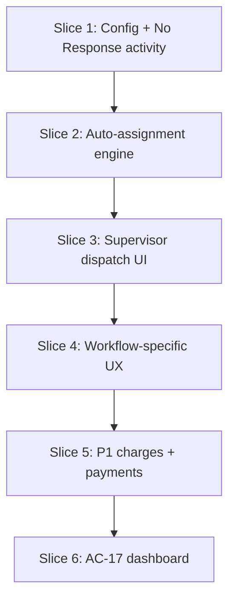

# Phase 2 roadmap (Spec v2.0 — Sept 2026)

This maps **Ticketify_Workflow_Functional_Requirements_Specification_v2** to what is **done**, **in progress**, and **next to build**. CRM remains source of truth for service requests; Ticketify orchestrates field workflows, assignment, comms, and reporting.

---

## 1. Spec priorities (recap)

| Priority | Themes |
|----------|--------|
| **P0** | CRM-synced workflows (Fault, New Connection, Relocation), assignment + GREEN/YELLOW/RED, LM handoff/return, No Response, core mobile + API |
| **P1** | Admin dashboard (Malé/Hulhumalé), charges/payments, templated SMS at scale, finance controls |

Architecture direction (spec + [ARCHITECTURE.md](./ARCHITECTURE.md)): **modular monolith** API, **CRM hexagonal adapter**, not microservices yet.

---

## 2. Roles & responsibilities (§3) — who does what

| Role | Primary system | Ticketify responsibility | Typical actions |
|------|----------------|---------------------------|-----------------|
| **Access Network technician** | Mobile app | Own SR on site; presence; schedule; LM handoff; No Response; close with charges (P1) | Assign/claim (if allowed), start/progress/close SR, schedule visit, hand over LM, mark No Response |
| **Transport / LM technician** | CRM (+ optional mobile later) | Complete **Last Mile Cabling** activity; not own Access SR queue | Receive team-pool activity; complete activity; (future) LM-complete from app |
| **Supervisor** | Admin panel | Dispatch oversight, manual assign, map, reports | View map (all states incl. busy note), reassign, override assignment policy exceptions |
| **Admin** | Admin panel | Users, config, dashboard, finance setup | Users/roles, workflow mapping, assignment policies, charge catalog, templates |
| **Customer** | SMS + review web | Notifications only (via API) | Schedule SMS, payment link (P1), feedback link |
| **Finance** (P1) | Admin + gateway | Charge approval, waivers, reconciliation | Catalog amounts, tax, payment webhooks |

**Gap today:** Supervisor-specific screens (dispatch queue, manual assign from pool) and LM technician mobile role are **not** fully built—LM is CRM/Transport team today.

---

## 3. Done in this repo (Phase 2 foundation + LM + presence)

| Area | Status | Notes |
|------|--------|--------|
| **GREEN / YELLOW / RED** | Done | `PATCH /users/presence`, busy comment; mobile 3-state UI |
| **Admin map presence** | Done | Green / yellow / red markers; busy note in list + drawer |
| **Schedule visit** | Done | CRM note + `VISIT_SCHEDULED` SMS template hook |
| **LM handoff** | Done | CRM activity (Last Mile Cabling), Transport team **pool only**, block SR until LM `COMPLETED` |
| **LM activity UI** | Done | Correct COMPLETED vs PENDING; handover button UX |
| **Charge catalog (read)** | Done | `GET /charges/catalog`, seed |
| **Notification templates** | Partial | Seed + render; not full trigger matrix |
| **Integration audit log** | Done | Schema + LM/schedule actions |
| **Assignment policy table** | Schema only | Default `MANUAL`; **no auto-engine** |
| **Ticket start/progress/close** | Done (Fault-like) | Dynamic CRM stages; CRM error handling improved |
| **No Response** | Partial | Tag toggle; **not** spec CRM activity type `No Response` |
| **Self “Assign to Me”** | Done | Manual claim from pool (keep/disable per Medianet #8) |
| **Security / CRM adapter** | Partial | Helmet, throttler, `CrmApiClient`; legacy `fetch` still migrating |

---

## 4. Remaining vs spec (by theme)

### 4.1 Workflows — Fault / New Connection / Relocation (P0)

| Item | Status | Depends on |
|------|--------|------------|
| Per-workflow CRM stage IDs (start/complete/LM) | Not wired | Medianet **workflow-mapping.json** (#1) |
| Guided steps in app (different buttons/copy per queue) | Not done | Mapping + taxonomy (#20) |
| Attachments / notes / activities per AC | Mostly exists | AC sign-off |

### 4.2 Last Mile (P0)

| Item | Status | Depends on |
|------|--------|------------|
| Create LM activity (Transport pool) | **Done** | — |
| Block Access until LM complete | **Done** | — |
| SR queue/stage on handoff or return | **Not done** | Medianet: activity-only vs stage change (#2) |
| LM tech completes in Ticketify app | **Not done** | Role + `PUT` activity complete (API exists) |
| SMS on LM events | Not done | Template matrix (#16) |

### 4.3 No Response (P0)

| Item | Status | Depends on |
|------|--------|------------|
| CRM model (tag vs **No Response** activity type) | Partial (tag) | Type ID `e398310c-…` in mapping (#3) |
| Customer SMS | Unknown | Medianet approval (#3, #16) |
| AC behaviour (when allowed, undo rules) | Not verified | UAT (#62) |

### 4.4 Assignment — **including auto-assign** (P0 core)

Spec §5.1 / §7: policies per **department / region / queue** → **MANUAL** or **AUTO**; rank candidates by rules; respect **YELLOW (busy)**.

| Item | Status | Depends on |
|------|--------|------------|
| **Auto-assignment engine** | **Not built** | Policies (#6–7), CRM assign API, unassigned pool definition |
| Ranking (SLA, workload, proximity) | Not built | Weights from Medianet (#7) |
| YELLOW handling (skip vs low priority) | Not built | Policy (#7, #9) |
| `busy_until` → auto GREEN | Not built | Product rule (#9) |
| Supervisor manual assign from admin | Partial (map only) | Dispatch UI |
| Self-claim “Assign to Me” | Done | Confirm keep (#8) |

**Planned implementation (next dev slice):**

1. `AssignmentEngineService`: load `AssignmentPolicy` + `workflow-mapping.json`.
2. Trigger: webhook/cron/poll **unassigned SRs** in CRM (or supervisor “Run auto-assign”).
3. Candidate set: technicians in queue/region with `presence=ONLINE` (optional: allow BUSY with penalty).
4. Score: configurable weights → CRM `assign` action.
5. Audit every auto-assign in `IntegrationAuditLog`.
6. Admin UI: edit policy mode + weights (Supervisor/Admin).

### 4.5 Communications (P0/P1)

| Item | Status |
|------|--------|
| Schedule SMS | Done (template hook) |
| LM / payment / No Response SMS | Not wired to matrix |
| Production SMS + review URL | Env (#17–18) |

### 4.6 Charges & payments (P1)

| Item | Status |
|------|--------|
| Catalog | Seed + GET |
| Add charges to ticket, tax, total | Not done |
| Payment gateway + webhook | Not done (#11–14) |
| Mobile “collect payment” | Not done |

### 4.7 Dashboard & reporting (P1 — AC-17)

| Item | Status |
|------|--------|
| Malé vs Hulhumalé tiles | Not done (#19) |
| SLA / aging vs CRM | Partial (reports module) |
| Supervisor operational dashboard | Map only |

### 4.8 Acceptance criteria AC-01–AC-20

Not formally traced in repo. Recommend Medianet **UAT owners** (#62) and a spreadsheet: AC id → test case → pass/fail.

---

## 5. What Medianet must still provide (blocks full P0)

See [PHASE2_MEDIANET_INPUTS.md](./PHASE2_MEDIANET_INPUTS.md). Minimum before **auto-assign + workflow hard-coding**:

1. Completed **workflow-mapping.json** (queues, stages, LM, No Response).
2. **Auto-assign rules**: pools (which CRM filter = unassigned), weights, busy rules, self-claim yes/no.
3. **LM return**: SR stage/team change when LM completes (if any).
4. Staging SRs + users per role for UAT.

---

## 6. Recommended development order (what we will build next)

| Slice | Deliverables | Effort (indicative) |
|-------|----------------|---------------------|
| **1 — Config & No Response** | Load `workflow-mapping.json` in all ticket actions; No Response via CRM activity type + audit; optional SMS | 1–2 weeks |
| **2 — Auto-assignment** | `AssignmentEngineService`, cron/admin trigger, CRM assign, ONLINE/YELLOW rules, audit | 2–3 weeks |
| **3 — Supervisor dispatch** | Admin: unassigned queue, manual assign, policy toggle, presence on assign | 1–2 weeks |
| **4 — Workflow UX** | Fault vs New Connection vs Relocation labels/steps; LM return stage sync if defined | 1–2 weeks |
| **5 — P1 commercial** | Apply charges, gateway webhook, templates | 2–4 weeks |
| **6 — Dashboard** | Malé/Hulhumalé breakdown, SLA tiles | 1–2 weeks |

**Yes — the spec includes auto-assign tickets.** It is **not implemented yet**; only manual assign + “Assign to Me” + a DB row defaulting to `MANUAL`.

---

## 7. Small quick wins (no CRM sheet)

- `busy_until` job: set presence → ONLINE when expired (#9).
- LM complete button for Transport role on linked activities (uses existing API).
- Migrate remaining ticket `fetch()` calls to `CrmApiClient`.
- AC traceability doc (checklist only).

---

## 8. Document maintenance

When Medianet delivers mapping or policy decisions, update:

- `ticketify-core-api-main/config/workflow-mapping.json`
- [PHASE2_MEDIANET_INPUTS.md](./PHASE2_MEDIANET_INPUTS.md) (check off items)
- This roadmap (move rows from Remaining → Done)
